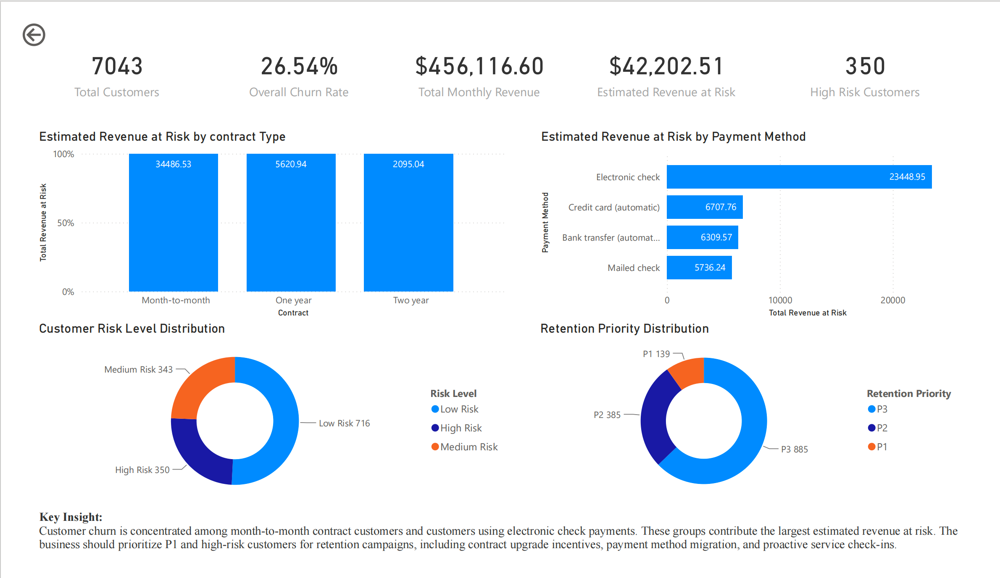
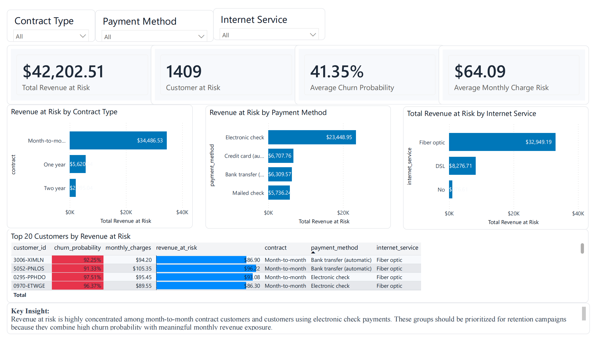
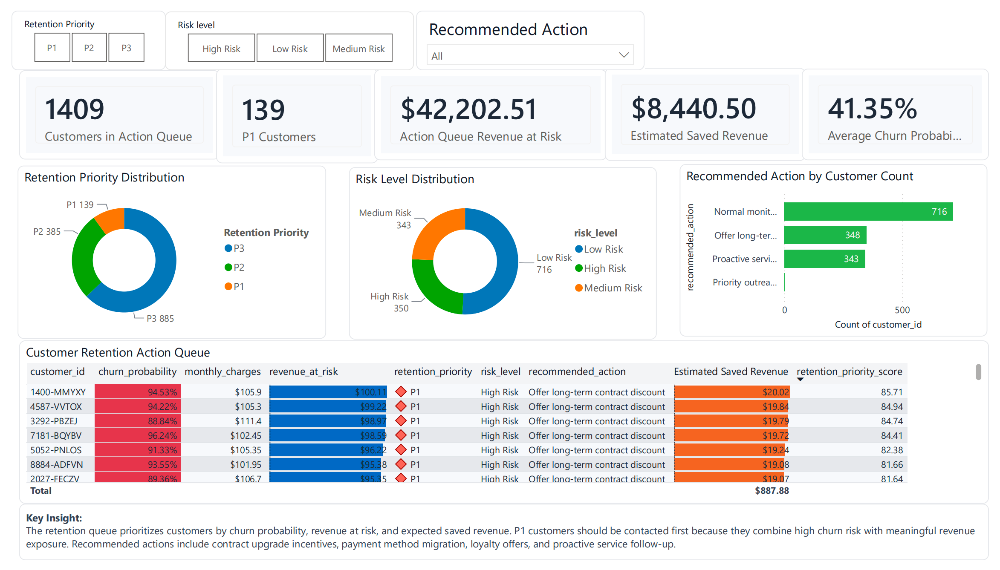
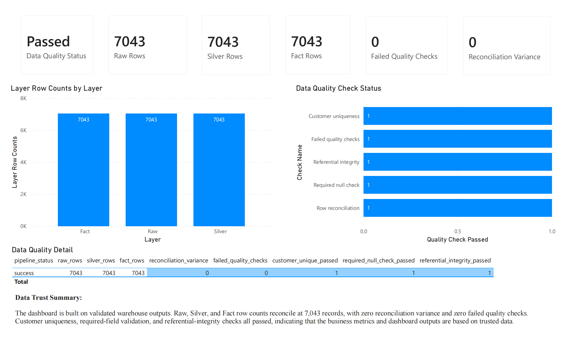
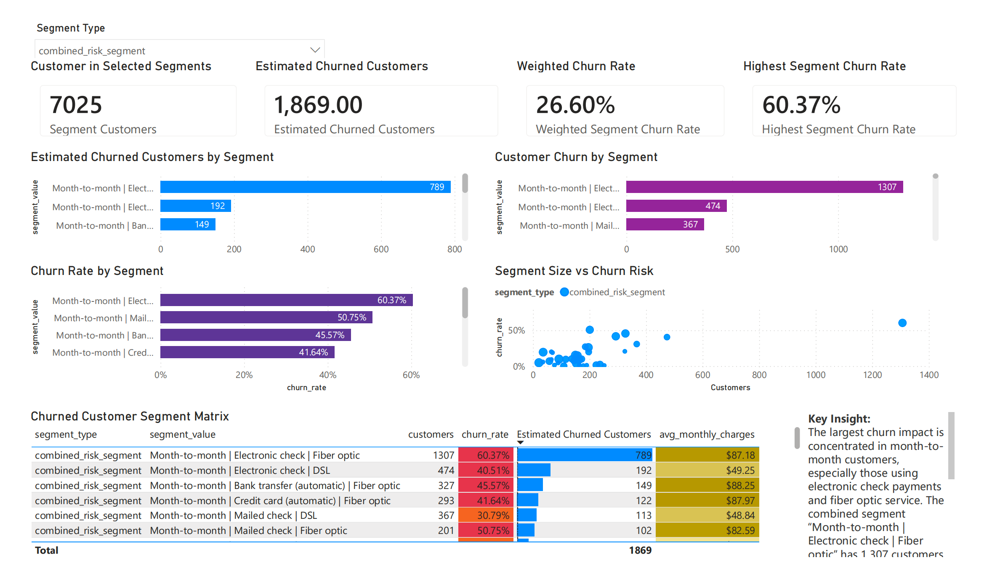

# Customer Churn Analytics Warehouse and BI Dashboard

An end-to-end analytics engineering project that turns the public Telco Customer Churn dataset into a tested retention decision system. It combines a reproducible Python pipeline, a dimensional warehouse, governed SQL marts, churn-risk scoring, data-quality monitoring, and BI-ready outputs.

## Overview

The project is designed to answer a practical question: **which customers and segments should a retention team prioritize, and can the underlying data be trusted?**

It demonstrates skills relevant to BI Engineer, Analytics Engineer, Data Quality Engineer, Junior Data Engineer, and Data Analyst roles.

## Business questions

1. What is the overall customer churn rate?
2. Which segments have the highest churn exposure?
3. How much monthly revenue is at risk?
4. Which customers should receive retention offers first?
5. Did the pipeline pass its quality gates before publishing the dashboard?

## Key results

| Metric | Result |
|---|---:|
| Source customers | 7,043 |
| Observed churn rate | 26.54% |
| Total monthly revenue | $456,116.60 |
| Customers in scored test set | 1,409 |
| High-risk customers | 350 |
| Probability-weighted monthly revenue at risk | ~$42,202.51 |
| Power BI-ready marts | 5 |
| Automated tests | 8 passing |

The warehouse contains all 7,043 customers. Revenue-at-risk and retention-action marts use the 1,409-customer scored artifact in `results/risk_table_with_recommendations.csv`.

## Dashboard preview

| Executive overview | Revenue at risk |
|---|---|
|  |  |

| Retention action queue | Data quality monitor |
|---|---|
|  |  |

### Segment analysis



The current dashboard highlights month-to-month contracts, electronic-check payments, and fiber-optic service as the main concentration of churn and revenue exposure. The action queue contains 1,409 scored customers, including 139 P1 customers, with an estimated $8,440.50 in monthly saved revenue under the 20% intervention-success scenario.

See the [Power BI dashboard guide](docs/POWERBI_DASHBOARD_GUIDE.md) for page design, measures, and data mapping.

## Architecture

```text
Raw Telco CSV
    ↓
Bronze source snapshot
    ↓
Cleaning, feature engineering, and quality gates
    ↓
Silver customers → dimensions + churn fact
    ↓
Gold aggregations + scored customers
    ↓
SQL marts
    ↓
Streamlit / Power BI exports / reports
```

The default workflow uses SQLite for a fast, reproducible local build. PostgreSQL, Airflow, and PySpark are optional deployment and scaling demonstrations rather than local prerequisites.

## Tech stack

- Python, pandas, scikit-learn
- SQL and SQLAlchemy
- SQLite; optional PostgreSQL
- Streamlit and Power BI
- pytest and GitHub Actions
- Optional Airflow and PySpark extensions

## Repository structure

```text
customer-churn-prediction/
├── dashboard/               # Streamlit decision-support app
├── data/raw/                # Source Telco dataset
├── docs/                    # Design, metrics, quality, and BI guides
├── reports/                 # Business findings and figures
├── results/                 # Selected model and scoring artifacts
├── scripts/                 # Warehouse, mart, export, and deployment entry points
├── spark/                   # Optional PySpark Gold transformations
├── sql/                     # Warehouse schema and dashboard marts
├── src/                     # Cleaning, training, scoring, quality, and warehouse logic
├── tests/                   # Automated pipeline tests
├── docker-compose.yml       # Optional PostgreSQL + dashboard stack
└── requirements.txt
```

Important committed result files:

- `model_results.csv`: Logistic Regression and Random Forest comparison
- `threshold_results.csv`: classification-threshold evaluation
- `risk_table_with_recommendations.csv`: complete 1,409-row scored set
- `top_30_high_risk_customers.csv`: clearly labeled sample of the highest-risk customers

## Quick start

### 1. Create an environment

```bash
python -m venv .venv
source .venv/bin/activate
python -m pip install --upgrade pip
python -m pip install -r requirements.txt
```

On Windows PowerShell, activate with `.venv\Scripts\Activate.ps1`.

### 2. Run tests

```bash
pytest -q
```

### 3. Build the warehouse

```bash
python scripts/build_churn_warehouse.py
```

This creates `data/warehouse/customer_churn_warehouse.sqlite`, including Bronze, Silver, dimension, fact, Gold, mart, and audit layers. The generated database is ignored by Git.

### 4. Launch Streamlit

```bash
streamlit run dashboard/app.py
```

Open `http://localhost:8501`.

### 5. Export Power BI data

```bash
python scripts/export_powerbi_data.py
```

The command creates five rebuildable CSVs in `results/powerbi_exports/`:

- `mart_churn_overview.csv`
- `mart_segment_churn.csv`
- `mart_revenue_at_risk.csv`
- `mart_retention_actions.csv`
- `mart_data_quality_status.csv`

## Warehouse and marts

| Layer | Main objects | Purpose |
|---|---|---|
| Bronze | `bronze_raw_customer_churn` | Source snapshot |
| Silver | `silver_clean_customers` | Standardized customer records |
| Dimensions | `dim_customer`, `dim_contract`, `dim_service`, `dim_payment` | Star-schema context |
| Fact | `fact_customer_churn` | Customer-level churn and charges |
| Gold | `gold_*` | Reusable segment aggregations |
| Scoring | `scored_customer_churn` | Probabilities and actions |
| Marts | `mart_*` | Dashboard-ready semantic layer |
| Audit | `meta_*` | Run history and quality evidence |

The five marts cover executive KPIs, segment churn, revenue exposure, retention actions, and pipeline health. Detailed schemas are in [Warehouse Design](docs/WAREHOUSE_DESIGN.md).

## Business metrics

```text
Observed churn rate = churned customers / total customers
Revenue at risk = churn probability × monthly charges
Estimated saved revenue = revenue at risk × 20%
```

Risk bands:

| Level | Rule |
|---|---|
| High | Probability ≥ 0.70 |
| Medium | 0.40 ≤ probability < 0.70 |
| Low | Probability < 0.40 |

See [Business Metrics](docs/BUSINESS_METRICS.md) for definitions and interpretation guidance.

## Data quality

The pipeline blocks final warehouse publication when critical checks fail. Checks cover:

- required columns and non-null business fields;
- unique customer identifiers;
- valid target, tenure, and charge ranges;
- Silver-to-Fact row reconciliation;
- dimension referential integrity;
- valid Gold-table churn rates;
- persisted run and check-level audit results.

The latest verified build has zero reconciliation variance and zero failed checks. See [Data Quality Monitoring](docs/DATA_QUALITY_MONITORING.md).

## Models and scoring

The project intentionally compares two interpretable baseline models: Logistic Regression and Random Forest. Scoring utilities validate probabilities, assign risk levels, estimate revenue exposure, and attach retention recommendations.

The dashboard generates the operational high-risk queue from the complete scored table; `top_30_high_risk_customers.csv` is only a compact portfolio sample.

## Power BI dashboard

The dashboard is organized into five pages:

1. Executive Overview
2. Churned Customer Analysis
3. Revenue at Risk
4. Retention Action Queue
5. Data Quality Monitor

Use `scripts/export_powerbi_data.py` to regenerate its source files. See [Power BI Dashboard Guide](docs/POWERBI_DASHBOARD_GUIDE.md).

## Tests and CI

The pytest suite validates cleaning rules, warehouse construction, row reconciliation, audit persistence, mart creation, and expected metrics. GitHub Actions runs the suite for every push and pull request.

```bash
pytest -q
```

## Optional extensions

- **PostgreSQL + Docker:** `docker compose up --build`
- **Airflow:** install `requirements-airflow.txt` and use the DAG in `dags/`
- **PySpark:** install `requirements-spark.txt` and run the script in `spark/`
Production limitations and next steps are documented in [Production Readiness](docs/PRODUCTION_READINESS.md).

## Documentation

The [documentation index](docs/README.md) links to detailed warehouse, metric, quality, Power BI, deployment, readiness, and portfolio guides.

## Portfolio value

This repository demonstrates a complete analytics workflow:

```text
raw data → trusted warehouse → governed marts → dashboard → action queue
```

It shows practical SQL, Python, dimensional modeling, data-quality controls, BI delivery, testing, and business interpretation without presenting optional infrastructure as a production dependency.
